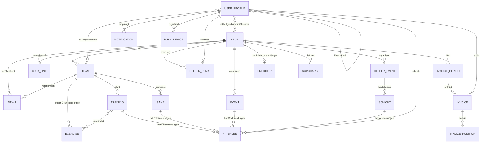

# Entity Model — myclub

> **Quelle:** Reverse Engineering aus `src/app/models/**` und den Firestore-Zugriffen in `src/app/services/**` (Stand 2026-07-17).
> Persistenz ist **Firebase Firestore** (dokumentenorientiert): "Foreign Keys" sind Referenz-Felder bzw. Sub-Collection-Pfade,
> Primärschlüssel sind Firestore-Dokument-IDs (Strings). Mitgliedschaften/Rollen (Mitglied, Admin, Elternteil, Anfrage) sind als
> Sub-Collections `members`, `admins`, `parents`, `requests` unter `club/{id}` bzw. `teams/{id}` abgebildet.

## Entity Relationship Diagram

### USER_PROFILE

Profil eines registrierten Nutzers (Firestore `userProfile/{uid}`, Interface `Profile` in `src/app/models/user.ts`).

| Attribute               | Description                                                | Data Type | Length/Precision | Validation Rules                   |
| ----------------------- | ---------------------------------------------------------- | --------- | ---------------- | ---------------------------------- |
| id                      | Firebase-Auth-UID, zugleich Dokument-ID                     | String    | 28               | Primary Key                        |
| email                   | E-Mail-Adresse (Login)                                      | String    | 100              | Not Null, Format: Email            |
| firstName               | Vorname                                                     | String    | 50               | Not Null                           |
| lastName                | Nachname                                                    | String    | 50               | Not Null                           |
| profilePicture          | URL des Profilbilds (Firebase Storage)                      | String    | 500              | Optional                           |
| phonenumber             | Telefonnummer                                               | String    | 20               | Optional                           |
| dateOfBirth             | Geburtsdatum                                                | DateTime  | -                | Optional                           |
| streetAndNumber         | Strasse und Hausnummer (kombiniert)                         | String    | 100              | Optional                           |
| street                  | Strasse (separat)                                           | String    | 100              | Optional                           |
| houseNumber             | Hausnummer (separat)                                        | String    | 10               | Optional                           |
| postalcode              | Postleitzahl                                                | Integer   | 10               | Optional                           |
| city                    | Ort                                                         | String    | 50               | Optional                           |
| licenseNumber           | Verbands-Lizenznummer                                       | String    | 50               | Optional                           |
| gender                  | Geschlecht                                                  | String    | 20               | Optional, Values: m, w             |
| ahvNumber               | AHV-Nummer (für J+S-Meldungen)                              | String    | 16               | Optional                           |
| nationality             | Nationalität (Ländercode)                                   | String    | 2                | Optional                           |
| country                 | Wohnsitzland (Ländercode)                                   | String    | 2                | Optional                           |
| settingsPush            | Push-Benachrichtigungen global aktiv                        | Boolean   | 1                | Not Null                           |
| settingsPushNews        | Push für Vereins-News                                       | Boolean   | 1                | Not Null                           |
| settingsPushNewsVerband | Push für Verbands-News                                      | Boolean   | 1                | Not Null                           |
| settingsPushTraining    | Push für Trainings                                          | Boolean   | 1                | Not Null                           |
| settingsPushChampionship | Push für Meisterschaftsspiele                              | Boolean   | 1                | Not Null                           |
| settingsPushEvent       | Push für Events                                             | Boolean   | 1                | Not Null                           |
| settingsPushHelfer      | Push für Helfer-Events                                      | Boolean   | 1                | Not Null                           |
| settingsEmail           | E-Mail-Benachrichtigungen aktiv                             | Boolean   | 1                | Not Null                           |
| settingsEmailReporting  | E-Mail-Reporting aktiv                                      | Boolean   | 1                | Not Null                           |
| showGamePreview         | Spielvorschau im News-Feed anzeigen                         | Boolean   | 1                | Not Null                           |
| gamePreviewDays         | Anzahl Tage der Spielvorschau                               | Integer   | 10               | Not Null, Min: 1, Max: 30          |
| hideEmail               | E-Mail vor anderen Mitgliedern verbergen                    | Boolean   | 1                | Not Null                           |
| hidePhoneNumber         | Telefonnummer vor anderen Mitgliedern verbergen             | Boolean   | 1                | Not Null                           |
| language                | Bevorzugte Sprache der App                                  | String    | 2                | Not Null, Values: de, en, fr, it   |
| favTeam                 | Favorisiertes Team                                          | String    | 20               | Optional, Foreign Key (TEAM.id)    |
| favClub                 | Favorisierter Verein                                        | String    | 20               | Optional, Foreign Key (CLUB.id)    |
| roles                   | Zugewiesene Vereinsfunktionen (Etiketten, Array)            | String    | 50 je Eintrag    | Optional                           |
| kids                    | Verknüpfte Kinder-Profile (Array von Referenzen)            | String    | 28 je Eintrag    | Optional, Foreign Key (USER_PROFILE.id), Max: 3 |
| helferPunkte            | Aktueller Helferpunkte-Stand (aggregiert)                   | Decimal   | 10,2             | Optional                           |
| isAdmin                 | Kennzeichen: Nutzer ist Admin (kontextabhängig gesetzt)     | Boolean   | 1                | Optional                           |
| isParent                | Kennzeichen: Nutzer ist Elternteil (kein aktives Mitglied)  | Boolean   | 1                | Optional                           |
| requestTeamId           | Team-ID der laufenden Beitrittsanfrage                      | String    | 20               | Optional, Foreign Key (TEAM.id)    |

**Constraints:** Eltern-Kind-Verknüpfung wird beidseitig als Sub-Collections `userProfile/{id}/children` und `userProfile/{id}/parents` geführt; maximal 3 Kinder pro Elternteil.

### CLUB

Ein Verein als oberste Organisationseinheit (Firestore `club/{clubId}`, Interface `Club` in `src/app/models/club.ts`).

| Attribute                | Description                                                        | Data Type | Length/Precision | Validation Rules                                                       |
| ------------------------ | ------------------------------------------------------------------ | --------- | ---------------- | ---------------------------------------------------------------------- |
| id                       | Dokument-ID des Vereins                                             | String    | 20               | Primary Key                                                             |
| name                     | Vereinsname                                                         | String    | 100              | Not Null                                                                |
| logo                     | URL des Vereinslogos                                                | String    | 500              | Optional                                                                |
| type                     | Vereins-/Verbandstyp                                                | String    | 30               | Not Null, Values: swissunihockey, swissvolley, swisshandball, swissturnverband, sports, culture, other |
| active                   | Verein ist aktiv                                                    | Boolean   | 1                | Not Null                                                                |
| wordpress                | WordPress-Quelle für News-Sync (URL/Kennung)                        | String    | 200              | Optional                                                                |
| website                  | Vereins-Website                                                     | String    | 200              | Optional                                                                |
| link_location            | Standort-Link (z. B. Karte)                                         | String    | 500              | Optional                                                                |
| address                  | Vereinsadresse                                                      | String    | 200              | Optional                                                                |
| phone                    | Kontakt-Telefonnummer                                               | String    | 20               | Optional                                                                |
| updated                  | Letzte Änderung                                                     | DateTime  | -                | Not Null                                                                |
| roles                    | Frei definierbare Vereinsfunktionen (Array)                         | String    | 50 je Eintrag    | Optional                                                                |
| helferThreshold          | Soll-Helferpunkte pro Mitglied                                      | Decimal   | 10,2             | Optional, Min: 0                                                        |
| eventThreshold           | Schwellwert für Events                                              | Integer   | 10               | Optional, Min: 0                                                        |
| helferReportingDateFrom  | Beginn des Helferpunkte-Reporting-Zeitraums                         | Date      | -                | Optional                                                                |
| helferReportingDateTo    | Ende des Helferpunkte-Reporting-Zeitraums                           | Date      | -                | Optional                                                                |
| helferPunkte             | Standard-Punktewert für Helfereinsätze                              | Decimal   | 10,2             | Optional, Min: 0                                                        |
| creditor                 | Zahlungsempfänger für QR-Rechnungen (eingebettetes Objekt)          | String    | -                | Optional, Foreign Key (CREDITOR)                                        |
| surcharges               | Zuschläge/Abzüge für Rechnungen (eingebettetes Array)               | String    | -                | Optional, Foreign Key (SURCHARGE)                                       |
| hasFeatureChampionship   | Feature-Flag Meisterschafts-Modul                                   | Boolean   | 1                | Optional                                                                |
| hasFeatureTrainingExercise | Feature-Flag Trainingsübungen                                     | Boolean   | 1                | Optional                                                                |
| hasFeatureHelferEvent    | Feature-Flag Helfer-Modul                                           | Boolean   | 1                | Optional                                                                |
| hasFeatureMyClubPro      | Feature-Flag PRO-Modul                                              | Boolean   | 1                | Optional                                                                |
| subscriptionActive       | Abo des Vereins ist aktiv (steuert Zugangssperre)                   | Boolean   | 1                | Optional                                                                |

**Constraints:** Wenn `helferReportingDateFrom` und `helferReportingDateTo` gesetzt sind, muss das Ende nach dem Beginn liegen. Sub-Collections: `members`, `admins`, `parents`, `requests`, `teams`, `news`, `events`, `helferEvents`, `helferPunkte`, `links`, `invoicePeriods`, `checkout_sessions`, `subscriptions`, `payments`, `games`, `contacts`.

### CREDITOR

Zahlungsempfänger-Angaben des Vereins für die Swiss-QR-Rechnung (eingebettet in `CLUB.creditor`).

| Attribute      | Description                     | Data Type | Length/Precision | Validation Rules |
| -------------- | ------------------------------- | --------- | ---------------- | ---------------- |
| account        | IBAN/QR-IBAN des Vereinskontos  | String    | 26               | Not Null         |
| name           | Name des Zahlungsempfängers     | String    | 70               | Not Null         |
| address        | Strasse                         | String    | 70               | Not Null         |
| buildingNumber | Hausnummer                      | String    | 16               | Not Null         |
| zip            | Postleitzahl                    | String    | 16               | Not Null         |
| city           | Ort                             | String    | 35               | Not Null         |
| country        | Ländercode                      | String    | 2                | Not Null         |

### SURCHARGE

Zuschlag oder Abzug, der bei der Rechnungsgenerierung auf den Jahresbeitrag angewendet wird (eingebettet in `CLUB.surcharges`).

| Attribute | Description                          | Data Type | Length/Precision | Validation Rules |
| --------- | ------------------------------------ | --------- | ---------------- | ---------------- |
| name      | Bezeichnung des Zuschlags/Abzugs     | String    | 100              | Not Null         |
| amount    | Betrag (negativ = Abzug)             | Decimal   | 10,2             | Not Null         |
| currency  | Währung                              | String    | 3                | Not Null, Values: CHF, EUR |

### TEAM

Ein Team/eine Mannschaft innerhalb eines Vereins (Firestore `teams/{teamId}`, Interface `Team` in `src/app/models/team.ts`).

| Attribute             | Description                                        | Data Type | Length/Precision | Validation Rules                |
| --------------------- | -------------------------------------------------- | --------- | ---------------- | ------------------------------- |
| id                    | Dokument-ID des Teams                              | String    | 20               | Primary Key                     |
| clubId                | Zugehöriger Verein                                 | String    | 20               | Not Null, Foreign Key (CLUB.id) |
| name                  | Teamname                                           | String    | 100              | Not Null                        |
| logo                  | URL des Team-Logos                                 | String    | 500              | Optional                        |
| website               | Team-Website                                       | String    | 200              | Optional                        |
| portrait              | Team-Portrait (Text/URL)                           | String    | 500              | Optional                        |
| liga                  | Liga-Bezeichnung                                   | String    | 50               | Optional                        |
| type                  | Team-Typ (analog Vereins-/Verbandstyp)             | String    | 30               | Optional                        |
| updated               | Letzte Änderung                                    | DateTime  | -                | Not Null                        |
| trainingThreshold     | Schwellwert Trainingsbeteiligung                   | Integer   | 10               | Optional, Min: 0                |
| championshipThreshold | Schwellwert Spielbeteiligung                       | Integer   | 10               | Optional, Min: 0                |
| jahresbeitragWert     | Jahresbeitrag des Teams (Basis der Rechnung)       | Decimal   | 10,2             | Optional, Min: 0                |
| jahresbeitragWaehrung | Währung des Jahresbeitrags                         | String    | 3                | Optional, Values: CHF, EUR      |

**Constraints:** Verbands-Subtypen (`SwissVolleyTeam` u. a.) ergänzen `gender`, `clubCaption`, `leagueCaption`, `organisationCaption`. Sub-Collections: `members`, `admins`, `requests`, `trainings`, `games`, `exercises`, `ranking/{jahr}/table`, `news`.

### TRAINING

Ein Trainingstermin eines Teams, einzeln oder als Serie erzeugt (Firestore `teams/{teamId}/trainings/{id}`, Interface `Training` in `src/app/models/training.ts`).

| Attribute        | Description                                              | Data Type | Length/Precision | Validation Rules                |
| ---------------- | -------------------------------------------------------- | --------- | ---------------- | ------------------------------- |
| id               | Dokument-ID des Trainings                                 | String    | 20               | Primary Key                     |
| name             | Bezeichnung                                               | String    | 100              | Not Null                        |
| description      | Beschreibung                                              | String    | 500              | Optional                        |
| location         | Ort/Halle                                                 | String    | 100              | Optional                        |
| streetAndNumber  | Strasse und Hausnummer                                    | String    | 100              | Optional                        |
| postalCode       | Postleitzahl                                              | String    | 10               | Optional                        |
| city             | Ort                                                       | String    | 50               | Optional                        |
| date             | Datum des Trainings                                       | DateTime  | -                | Not Null                        |
| timeFrom         | Beginn (Uhrzeit)                                          | String    | 5                | Not Null                        |
| timeTo           | Ende (Uhrzeit)                                            | String    | 5                | Not Null                        |
| startDate        | Serienbeginn (Berechnungsfeld)                            | Date      | -                | Optional                        |
| endDate          | Serienende (Berechnungsfeld)                              | Date      | -                | Optional                        |
| repeatAmount     | Anzahl Wiederholungen der Serie                           | Integer   | 10               | Optional, Min: 1                |
| repeatFrequency  | Wiederholungsintervall der Serie                          | String    | 20               | Optional                        |
| teamId           | Zugehöriges Team                                          | String    | 20               | Not Null, Foreign Key (TEAM.id) |
| teamName         | Teamname (denormalisiert)                                 | String    | 100              | Optional                        |
| liga             | Liga (denormalisiert)                                     | String    | 50               | Optional                        |
| cancelled        | Training ist abgesagt                                     | Boolean   | 1                | Optional                        |
| cancelledReason  | Absagegrund                                               | String    | 200              | Optional                        |
| lastReminderSent | Zeitpunkt der letzten Erinnerung                          | DateTime  | -                | Optional                        |
| status           | Rückmeldestatus des aktuellen Nutzers (Laufzeitfeld)      | Boolean   | 1                | Optional                        |
| countAttendees   | Anzahl Zusagen (aggregiert, Laufzeitfeld)                 | Integer   | 10               | Optional                        |
| attendees        | Rückmeldungen (Laufzeit-Aggregation aus Sub-Collection)   | String    | -                | Optional, Foreign Key (ATTENDEE) |
| exercises        | Zugeordnete Übungen (Laufzeit-Aggregation)                | String    | -                | Optional, Foreign Key (EXERCISE) |
| children         | Rückmeldungen der eigenen Kinder (Laufzeitfeld)           | String    | -                | Optional                        |
| isMember         | Nutzer ist Team-Mitglied (Laufzeitfeld)                   | Boolean   | 1                | Optional                        |

**Constraints:** Bei Serien muss `endDate` nach `startDate` liegen; `timeTo` nach `timeFrom`.

### EVENT

Eine Vereinsveranstaltung (Firestore `club/{clubId}/events/{id}`, Interface `Veranstaltung` in `src/app/models/event.ts`).

| Attribute        | Description                                             | Data Type | Length/Precision | Validation Rules                |
| ---------------- | ------------------------------------------------------- | --------- | ---------------- | ------------------------------- |
| id               | Dokument-ID des Events                                   | String    | 20               | Primary Key                     |
| name             | Bezeichnung                                              | String    | 100              | Not Null                        |
| description      | Beschreibung                                             | String    | 1000             | Optional                        |
| location         | Ort/Lokalität                                            | String    | 100              | Optional                        |
| streetAndNumber  | Strasse und Hausnummer                                   | String    | 100              | Optional                        |
| postalCode       | Postleitzahl                                             | String    | 10               | Optional                        |
| city             | Ort                                                      | String    | 50               | Optional                        |
| date             | Datum des Events                                         | DateTime  | -                | Not Null                        |
| startDate        | Startdatum (mehrtägig)                                   | Date      | -                | Optional                        |
| endDate          | Enddatum (mehrtägig)                                     | Date      | -                | Optional                        |
| timeFrom         | Beginn (Uhrzeit)                                         | String    | 5                | Not Null                        |
| timeTo           | Ende (Uhrzeit)                                           | String    | 5                | Not Null                        |
| link_web         | Weiterführender Link                                     | String    | 500              | Optional                        |
| link_poll        | Link zu einer Umfrage                                    | String    | 500              | Optional                        |
| clubId           | Organisierender Verein                                   | String    | 20               | Not Null, Foreign Key (CLUB.id) |
| clubName         | Vereinsname (denormalisiert)                             | String    | 100              | Optional                        |
| countNeeded      | Benötigte Teilnehmerzahl                                 | Integer   | 10               | Optional, Min: 0                |
| closedEvent      | Geschlossener Teilnehmerkreis                            | Boolean   | 1                | Optional                        |
| cancelled        | Event ist abgesagt                                       | Boolean   | 1                | Optional                        |
| cancelledReason  | Absagegrund                                              | String    | 200              | Optional                        |
| lastReminderSent | Zeitpunkt der letzten Erinnerung                         | DateTime  | -                | Optional                        |
| status           | Rückmeldestatus des aktuellen Nutzers (Laufzeitfeld)     | Boolean   | 1                | Optional                        |
| countAttendees   | Anzahl Zusagen (aggregiert, Laufzeitfeld)                | Integer   | 10               | Optional                        |
| attendees        | Rückmeldungen (Laufzeit-Aggregation aus Sub-Collection)  | String    | -                | Optional, Foreign Key (ATTENDEE) |
| children         | Rückmeldungen der eigenen Kinder (Laufzeitfeld)          | String    | -                | Optional                        |
| isMember         | Nutzer ist Vereins-Mitglied (Laufzeitfeld)               | Boolean   | 1                | Optional                        |

### HELFER_EVENT

Ein Helfer-Event mit Schichtplanung; erbt alle Attribute von EVENT (Firestore `club/{clubId}/helferEvents/{id}`, Interface `HelferEvent extends Veranstaltung`).

| Attribute | Description                                     | Data Type | Length/Precision | Validation Rules               |
| --------- | ----------------------------------------------- | --------- | ---------------- | ------------------------------ |
| id        | Dokument-ID des Helfer-Events                    | String    | 20               | Primary Key                    |
| schichten | Schichten des Events (Sub-Collection `schichten`) | String    | -                | Optional, Foreign Key (SCHICHT) |

### SCHICHT

Eine Helfer-Schicht mit Zeitfenster, Punktewert und Personalbedarf (Firestore `club/{clubId}/helferEvents/{id}/schichten/{id}`, Interface `Schicht` in `src/app/models/event.ts`).

| Attribute      | Description                                    | Data Type | Length/Precision | Validation Rules                 |
| -------------- | ---------------------------------------------- | --------- | ---------------- | -------------------------------- |
| id             | Schicht-Nummer                                 | Integer   | 10               | Primary Key                      |
| name           | Bezeichnung der Schicht                        | String    | 100              | Not Null                         |
| points         | Helferpunkte für diese Schicht                 | Decimal   | 10,2             | Not Null, Min: 0                 |
| timeFrom       | Beginn (Uhrzeit)                               | String    | 5                | Not Null                         |
| timeTo         | Ende (Uhrzeit)                                 | String    | 5                | Not Null                         |
| countNeeded    | Benötigte Helferzahl                           | Integer   | 10               | Not Null, Min: 1                 |
| countAttendees | Anzahl Anmeldungen (aggregiert)                | Integer   | 10               | Optional                         |
| children       | Anmeldungen der eigenen Kinder (Laufzeitfeld)  | String    | -                | Optional                         |
| status         | Anmeldestatus des aktuellen Nutzers (Laufzeit) | Boolean   | 1                | Optional                         |

### GAME

Ein Meisterschaftsspiel eines Teams, aus Verbandsdaten synchronisiert oder manuell erfasst (Firestore `teams/{teamId}/games/{id}`, Interface `Game` in `src/app/models/game.ts`).

| Attribute        | Description                                            | Data Type | Length/Precision | Validation Rules                |
| ---------------- | ------------------------------------------------------ | --------- | ---------------- | ------------------------------- |
| id               | Dokument-ID des Spiels                                  | String    | 20               | Primary Key                     |
| externalId       | ID im Verbandssystem                                    | String    | 50               | Optional                        |
| date             | Spieldatum (Text)                                       | String    | 10               | Not Null                        |
| time             | Spielzeit (Text)                                        | String    | 5                | Not Null                        |
| dateTime         | Spielbeginn (kombiniert)                                | DateTime  | -                | Not Null                        |
| location         | Spielort/Halle                                          | String    | 100              | Optional                        |
| city             | Ort                                                     | String    | 50               | Optional                        |
| longitude        | Geokoordinate Länge (Kartenanzeige)                     | String    | 20               | Optional                        |
| latitude         | Geokoordinate Breite (Kartenanzeige)                    | String    | 20               | Optional                        |
| liga             | Liga-Bezeichnung                                        | String    | 50               | Optional                        |
| name             | Bezeichnung des Spiels                                  | String    | 100              | Optional                        |
| description      | Beschreibung                                            | String    | 500              | Optional                        |
| teamId           | Zugehöriges (eigenes) Team                              | String    | 20               | Not Null, Foreign Key (TEAM.id) |
| teamName         | Teamname (denormalisiert)                               | String    | 100              | Optional                        |
| clubId           | Zugehöriger Verein                                      | String    | 20               | Optional, Foreign Key (CLUB.id) |
| teamHomeId       | Heimteam-ID (Verband)                                   | String    | 50               | Optional                        |
| teamHome         | Heimteam-Name                                           | String    | 100              | Optional                        |
| teamHomeLogo     | Heimteam-Logo (URL)                                     | String    | 500              | Optional                        |
| teamHomeLogoText | Heimteam-Kürzel                                         | String    | 10               | Optional                        |
| teamAwayId       | Gastteam-ID (Verband)                                   | String    | 50               | Optional                        |
| teamAway         | Gastteam-Name                                           | String    | 100              | Optional                        |
| teamAwayLogo     | Gastteam-Logo (URL)                                     | String    | 500              | Optional                        |
| teamAwayLogoText | Gastteam-Kürzel                                         | String    | 10               | Optional                        |
| referee1         | Schiedsrichter 1                                        | String    | 100              | Optional                        |
| referee2         | Schiedsrichter 2                                        | String    | 100              | Optional                        |
| spectators       | Zuschauerzahl                                           | Integer   | 10               | Optional                        |
| result           | Resultat                                                | String    | 20               | Optional                        |
| type             | Spieltyp/Verband                                        | String    | 30               | Optional                        |
| gameStatus       | Spielstatus (Verband)                                   | String    | 30               | Optional                        |
| updated          | Letzte Änderung                                         | DateTime  | -                | Optional                        |
| status           | Rückmeldestatus des aktuellen Nutzers (Laufzeitfeld)    | Boolean   | 1                | Optional                        |
| countAttendees   | Anzahl Zusagen (aggregiert, Laufzeitfeld)               | Integer   | 10               | Optional                        |
| attendees        | Rückmeldungen (Laufzeit-Aggregation aus Sub-Collection) | String    | -                | Optional, Foreign Key (ATTENDEE) |
| children         | Rückmeldungen der eigenen Kinder (Laufzeitfeld)         | String    | -                | Optional                        |
| isMember         | Nutzer ist Team-Mitglied (Laufzeitfeld)                 | Boolean   | 1                | Optional                        |

### ATTENDEE

Rückmeldung (Zusage/Absage bzw. Schicht-Anmeldung) eines Nutzers zu Training, Spiel, Event oder Schicht; Dokument-ID = User-ID (Firestore `.../attendees/{uid}`).

| Attribute | Description                                            | Data Type | Length/Precision | Validation Rules                        |
| --------- | ------------------------------------------------------ | --------- | ---------------- | --------------------------------------- |
| id        | User-ID des Antwortenden (Dokument-ID)                  | String    | 28               | Primary Key, Foreign Key (USER_PROFILE.id) |
| status    | Zusage (true) oder Absage (false)                       | Boolean   | 1                | Not Null                                |
| changedAt | Zeitpunkt der letzten Änderung                          | DateTime  | -                | Not Null                                |
| confirmed | Einsatz durch Admin bestätigt (nur Helfer-Schichten)    | Boolean   | 1                | Optional                                |

### EXERCISE

Eine Trainingsübung aus der globalen oder Team-Übungsbibliothek, einem Training in Reihenfolge zuordenbar (Firestore `exercises`, `teams/{id}/exercises`, `teams/{id}/trainings/{id}/exercises`).

| Attribute   | Description                            | Data Type | Length/Precision | Validation Rules |
| ----------- | -------------------------------------- | --------- | ---------------- | ---------------- |
| id          | Dokument-ID der Übung                  | String    | 20               | Primary Key      |
| title       | Titel der Übung                        | String    | 100              | Not Null         |
| description | Beschreibung/Durchführung              | String    | 1000             | Optional         |
| order       | Reihenfolge innerhalb eines Trainings  | Integer   | 10               | Not Null, Min: 0 |

### NEWS

Ein News-Beitrag eines Vereins, Teams oder Verbands (Firestore `club/{id}/news`, `teams/{id}/news`, global `news`; Interface `News` in `src/app/models/news.ts`).

| Attribute   | Description                                  | Data Type | Length/Precision | Validation Rules                |
| ----------- | -------------------------------------------- | --------- | ---------------- | ------------------------------- |
| id          | Dokument-ID der News                          | String    | 20               | Primary Key                     |
| title       | Titel                                         | String    | 200              | Not Null                        |
| slug        | URL-Kürzel                                    | String    | 200              | Optional                        |
| image       | Titelbild (URL)                               | String    | 500              | Optional                        |
| leadText    | Anrisstext                                    | String    | 500              | Optional                        |
| date        | Publikationsdatum                             | DateTime  | -                | Not Null                        |
| text        | Inhalt (Plaintext)                            | String    | 10000            | Optional                        |
| htmlText    | Inhalt (HTML)                                 | String    | 10000            | Optional                        |
| tags        | Schlagworte (Array)                           | String    | 50 je Eintrag    | Optional                        |
| author      | Autor                                         | String    | 100              | Optional                        |
| authorImage | Autorenbild (URL)                             | String    | 500              | Optional                        |
| url         | Externer Link (z. B. WordPress/Verband)       | String    | 500              | Optional                        |
| filterable  | Filterkategorie                               | String    | 50               | Optional                        |
| type        | Quelle/Typ (Verein, Verband)                  | String    | 30               | Optional                        |
| source      | Quellsystem                                   | String    | 50               | Optional                        |
| clubId      | Zugehöriger Verein                            | String    | 20               | Optional, Foreign Key (CLUB.id) |

### CLUB_LINK

Ein vom Verein gepflegter Link (Web, Bild oder PDF) (Firestore `club/{clubId}/links/{id}`, Interface `ClubLink` in `src/app/models/club-link.ts`).

| Attribute   | Description                          | Data Type | Length/Precision | Validation Rules                 |
| ----------- | ------------------------------------ | --------- | ---------------- | -------------------------------- |
| id          | Dokument-ID des Links                | String    | 20               | Primary Key                      |
| order       | Sortierreihenfolge                   | Integer   | 10               | Not Null, Min: 0                 |
| title       | Titel                                | String    | 100              | Not Null                         |
| description | Beschreibung                         | String    | 300              | Optional                         |
| type        | Link-Typ                             | String    | 10               | Not Null, Values: web, image, pdf |
| url         | Ziel-URL (Web oder Storage-Datei)    | String    | 500              | Not Null                         |
| showOnCard  | Auf der Vereinskarte anzeigen        | Boolean   | 1                | Not Null                         |
| createdAt   | Erstellt am                          | DateTime  | -                | Not Null                         |
| updatedAt   | Geändert am                          | DateTime  | -                | Not Null                         |

### INVOICE_PERIOD

Eine Abrechnungsperiode, unter der Mitgliederrechnungen gruppiert werden (Firestore `club/{clubId}/invoicePeriods/{id}`).

| Attribute | Description                                | Data Type | Length/Precision | Validation Rules |
| --------- | ------------------------------------------ | --------- | ---------------- | ---------------- |
| id        | Dokument-ID der Periode                    | String    | 20               | Primary Key      |
| name      | Bezeichnung (z. B. "Jahresbeitrag 2026")   | String    | 100              | Not Null         |

### INVOICE

Eine Mitgliederrechnung innerhalb einer Abrechnungsperiode (Firestore `club/{clubId}/invoicePeriods/{periodId}/invoices/{id}`, Felder aus `invoice.service.ts` und `club-invoice-detail.page.ts`).

| Attribute        | Description                                               | Data Type | Length/Precision | Validation Rules                              |
| ---------------- | --------------------------------------------------------- | --------- | ---------------- | --------------------------------------------- |
| id               | Dokument-ID der Rechnung                                   | String    | 20               | Primary Key                                   |
| referenceId      | Interne Referenz                                           | String    | 50               | Optional                                      |
| referenceNumber  | QR-Referenznummer (27-stellig, MOD10-Prüfziffer)           | String    | 27               | Not Null, Unique                              |
| memberId         | Rechnungsempfänger (Mitglied)                              | String    | 28               | Not Null, Foreign Key (USER_PROFILE.id)       |
| clubId           | Rechnungssteller (Verein)                                  | String    | 20               | Not Null, Foreign Key (CLUB.id)               |
| periodId         | Zugehörige Abrechnungsperiode                              | String    | 20               | Not Null, Foreign Key (INVOICE_PERIOD.id)     |
| firstName        | Vorname des Empfängers (denormalisiert)                    | String    | 50               | Not Null                                      |
| lastName         | Nachname des Empfängers (denormalisiert)                   | String    | 50               | Not Null                                      |
| email            | E-Mail des Empfängers (denormalisiert)                     | String    | 100              | Optional, Format: Email                       |
| amount           | Rechnungsbetrag (Summe der Positionen)                     | Decimal   | 10,2             | Not Null, Min: 0                              |
| currency         | Währung                                                    | String    | 3                | Not Null, Values: CHF, EUR                    |
| status           | Rechnungsstatus (steuert Versand durch Cloud Function)     | String    | 20               | Not Null, Values: draft, send, sent, bezahlt  |
| positions        | Rechnungspositionen (eingebettetes Array)                  | String    | -                | Optional, Foreign Key (INVOICE_POSITION)      |
| paymentDate      | Zahlungsdatum                                              | Date      | -                | Optional                                      |
| payer            | Zahler (Freitext)                                          | String    | 100              | Optional                                      |
| lastReminderSent | Zeitpunkt der letzten Zahlungserinnerung                   | DateTime  | -                | Optional                                      |
| createdBy        | Ersteller der Rechnung                                     | String    | 28               | Not Null, Foreign Key (USER_PROFILE.id)       |
| createdAt        | Erstellt am                                                | DateTime  | -                | Not Null                                      |

### INVOICE_POSITION

Eine einzelne Position einer Mitgliederrechnung (eingebettet in `INVOICE.positions`; erzeugt aus Team-Jahresbeiträgen und Zuschlägen/Abzügen).

| Attribute | Description                                   | Data Type | Length/Precision | Validation Rules |
| --------- | --------------------------------------------- | --------- | ---------------- | ---------------- |
| name      | Bezeichnung (z. B. Teamname oder Zuschlag)    | String    | 100              | Not Null         |
| amount    | Betrag der Position (negativ = Abzug)         | Decimal   | 10,2             | Not Null         |
| currency  | Währung                                       | String    | 3                | Not Null, Values: CHF, EUR |

### HELFER_PUNKT

Eine Helferpunkte-Buchung für ein Mitglied — aus bestätigtem Schichteinsatz oder manueller Buchung (Firestore `club/{clubId}/helferPunkte/{id}`, Felder aus `helfer.service.ts`).

| Attribute   | Description                                    | Data Type | Length/Precision | Validation Rules                        |
| ----------- | ---------------------------------------------- | --------- | ---------------- | --------------------------------------- |
| id          | Dokument-ID der Buchung                        | String    | 20               | Primary Key                             |
| userId      | Begünstigtes Mitglied                          | String    | 28               | Not Null, Foreign Key (USER_PROFILE.id) |
| userRef     | Dokument-Referenz auf das Mitgliederprofil     | String    | 100              | Not Null, Foreign Key (USER_PROFILE.id) |
| name        | Bezeichnung der Buchung                        | String    | 100              | Not Null                                |
| eventName   | Name des zugehörigen Events                    | String    | 100              | Optional                                |
| date        | Buchungsdatum                                  | DateTime  | -                | Not Null                                |
| eventDate   | Datum des Einsatzes/Events                     | DateTime  | -                | Not Null                                |
| points      | Anzahl gutgeschriebener Punkte                 | Decimal   | 10,2             | Not Null                                |
| status      | Buchung aktiv                                  | Boolean   | 1                | Not Null                                |
| confirmed   | Buchung bestätigt                              | Boolean   | 1                | Not Null                                |
| confirmedBy | Bestätigender Admin (Dokument-Referenz)        | String    | 100              | Optional, Foreign Key (USER_PROFILE.id) |

### NOTIFICATION

Eine In-App-Benachrichtigung eines Nutzers mit Gelesen-Status (Firestore `userProfile/{uid}/notification/{id}`, Felder aus `notification.service.ts`).

| Attribute | Description                                | Data Type | Length/Precision | Validation Rules |
| --------- | ------------------------------------------ | --------- | ---------------- | ---------------- |
| id        | Dokument-ID der Benachrichtigung           | String    | 20               | Primary Key      |
| date      | Zeitpunkt der Benachrichtigung             | DateTime  | -                | Not Null         |
| opened    | Benachrichtigung wurde gelesen             | Boolean   | 1                | Not Null         |

### PUSH_DEVICE

Ein für Push-Benachrichtigungen registriertes Gerät eines Nutzers (Firestore `userProfile/{uid}/push/{identifier}`, Felder aus `user-profile.service.ts`).

| Attribute       | Description                          | Data Type | Length/Precision | Validation Rules |
| --------------- | ------------------------------------ | --------- | ---------------- | ---------------- |
| identifier      | Geräte-Kennung (Dokument-ID)         | String    | 100              | Primary Key      |
| token           | FCM-Push-Token                       | String    | 500              | Not Null         |
| pushObject      | Push-Registrierungsobjekt (Rohdaten) | String    | 1000             | Optional         |
| model           | Gerätemodell                         | String    | 50               | Optional         |
| operatingSystem | Betriebssystem                       | String    | 20               | Optional         |
| osVersion       | Betriebssystem-Version               | String    | 20               | Optional         |
| platform        | Plattform (ios, android, web)        | String    | 10               | Not Null, Values: ios, android, web |
| updated         | Letzte Aktualisierung                | DateTime  | -                | Not Null         |
