# Use Cases Overview — myclub

> **Quelle:** [requirements.md](requirements.md), Stand 2026-07-17. Jeder Use Case ist auf funktionale
> Requirements (FR) zurückführbar (Tabelle unten). Detail-Spezifikationen liegen in [use_cases/](use_cases/).

```mermaid
flowchart LR
    guest([👤 Gast])
    member([🙋 Mitglied])
    parent([👨‍👧 Elternteil])
    teamadmin([📋 Team-Admin])
    clubadmin([🔧 Club-Admin])
    system([🖥️ System])

    subgraph "myclub App"
        subgraph "Konto & Onboarding"
            UC001[UC-001\nKonto registrieren und verifizieren]
            UC002[UC-002\nAm System anmelden]
            UC003[UC-003\nVerein beitreten]
            UC004[UC-004\nVerein gründen]
            UC005[UC-005\nProfil und Einstellungen verwalten]
            UC006[UC-006\nKinder verknüpfen]
        end

        subgraph "News & Kommunikation"
            UC007[UC-007\nNews lesen]
            UC008[UC-008\nNews erstellen]
            UC009[UC-009\nPush-Benachrichtigungen zustellen]
        end

        subgraph "Training"
            UC010[UC-010\nTraining planen]
            UC011[UC-011\nTraining beantworten]
            UC012[UC-012\nAnwesenheiten verwalten]
            UC013[UC-013\nTrainingsübungen planen]
        end

        subgraph "Events"
            UC014[UC-014\nEvent organisieren]
            UC015[UC-015\nEvent beantworten]
        end

        subgraph "Team & Verein"
            UC016[UC-016\nTeam verwalten]
            UC017[UC-017\nVerein verwalten]
            UC018[UC-018\nMitglieder und Funktionen verwalten]
            UC019[UC-019\nBeitrittsanfragen bearbeiten]
            UC020[UC-020\nMitgliederdaten exportieren]
        end

        subgraph "Meisterschaft"
            UC021[UC-021\nSpielplan und Rangliste einsehen]
            UC022[UC-022\nSpiel beantworten]
            UC023[UC-023\nSpiele verwalten]
        end

        subgraph "Helfer"
            UC024[UC-024\nHelfer-Event organisieren]
            UC025[UC-025\nHelferschicht übernehmen]
            UC026[UC-026\nEinsätze bestätigen und Punkte verwalten]
            UC027[UC-027\nHelferpunkte einsehen]
        end

        subgraph "Beitragsverwaltung"
            UC028[UC-028\nRechnungslauf erstellen]
            UC029[UC-029\nRechnungen versenden und überwachen]
            UC030[UC-030\nEigene Rechnungen einsehen]
        end

        subgraph "J+S & Abo"
            UC031[UC-031\nJ+S-Daten exportieren]
            UC032[UC-032\nVereins-Abo verwalten]
            UC033[UC-033\nZugang bei inaktivem Abo sperren]
        end
    end

    guest --> UC001
    guest --> UC002

    member --> UC003
    member --> UC004
    member --> UC005
    member --> UC007
    member --> UC011
    member --> UC015
    member --> UC021
    member --> UC022
    member --> UC025
    member --> UC027
    member --> UC030

    parent --> UC006
    parent --> UC011
    parent --> UC015
    parent --> UC022
    parent --> UC025

    teamadmin --> UC010
    teamadmin --> UC012
    teamadmin --> UC013
    teamadmin --> UC016
    teamadmin --> UC019
    teamadmin --> UC023
    teamadmin --> UC031

    clubadmin --> UC008
    clubadmin --> UC014
    clubadmin --> UC017
    clubadmin --> UC018
    clubadmin --> UC019
    clubadmin --> UC020
    clubadmin --> UC024
    clubadmin --> UC026
    clubadmin --> UC028
    clubadmin --> UC029
    clubadmin --> UC032

    system --> UC009
    system --> UC029
    system --> UC033
```

## Traceability: Use Cases → Requirements

| Use Case | Titel                                     | Akteure                      | Requirements                            |
| -------- | ----------------------------------------- | ---------------------------- | --------------------------------------- |
| UC-001   | Konto registrieren und verifizieren       | Gast                         | FR-001, FR-002                          |
| UC-002   | Am System anmelden                        | Gast                         | FR-003, FR-004                          |
| UC-003   | Verein beitreten                          | Mitglied                     | FR-007, FR-009, FR-010                  |
| UC-004   | Verein gründen                            | Mitglied                     | FR-008                                  |
| UC-005   | Profil und Einstellungen verwalten        | Mitglied                     | FR-005, FR-006, FR-011–FR-015           |
| UC-006   | Kinder verknüpfen                         | Elternteil                   | FR-016                                  |
| UC-007   | News lesen                                | Mitglied                     | FR-018, FR-019, FR-021, FR-023          |
| UC-008   | News erstellen                            | Club-Admin                   | FR-020                                  |
| UC-009   | Push-Benachrichtigungen zustellen         | System                       | FR-022                                  |
| UC-010   | Training planen                           | Team-Admin                   | FR-024, FR-027, FR-028, FR-029          |
| UC-011   | Training beantworten                      | Mitglied, Elternteil         | FR-025, FR-017                          |
| UC-012   | Anwesenheiten verwalten                   | Team-Admin                   | FR-026                                  |
| UC-013   | Trainingsübungen planen                   | Team-Admin                   | FR-030                                  |
| UC-014   | Event organisieren                        | Club-Admin                   | FR-031, FR-033, FR-034, FR-035          |
| UC-015   | Event beantworten                         | Mitglied, Elternteil         | FR-032, FR-017                          |
| UC-016   | Team verwalten                            | Team-Admin                   | FR-036, FR-037, FR-038, FR-040          |
| UC-017   | Verein verwalten                          | Club-Admin                   | FR-041, FR-046, FR-047, FR-048          |
| UC-018   | Mitglieder und Funktionen verwalten       | Club-Admin                   | FR-042, FR-043, FR-044                  |
| UC-019   | Beitrittsanfragen bearbeiten              | Club-Admin, Team-Admin       | FR-039, FR-045                          |
| UC-020   | Mitgliederdaten exportieren               | Club-Admin                   | FR-049                                  |
| UC-021   | Spielplan und Rangliste einsehen          | Mitglied                     | FR-050, FR-054, FR-055                  |
| UC-022   | Spiel beantworten                         | Mitglied, Elternteil         | FR-051, FR-017                          |
| UC-023   | Spiele verwalten                          | Team-Admin                   | FR-052, FR-053, FR-056                  |
| UC-024   | Helfer-Event organisieren                 | Club-Admin                   | FR-057                                  |
| UC-025   | Helferschicht übernehmen                  | Mitglied, Elternteil         | FR-058, FR-017                          |
| UC-026   | Einsätze bestätigen und Punkte verwalten  | Club-Admin                   | FR-059, FR-061, FR-062                  |
| UC-027   | Helferpunkte einsehen                     | Mitglied                     | FR-060                                  |
| UC-028   | Rechnungslauf erstellen                   | Club-Admin                   | FR-063, FR-064, FR-068                  |
| UC-029   | Rechnungen versenden und überwachen       | Club-Admin, System           | FR-065, FR-066, FR-067, FR-069          |
| UC-030   | Eigene Rechnungen einsehen                | Mitglied                     | FR-070                                  |
| UC-031   | J+S-Daten exportieren                     | Team-Admin                   | FR-071                                  |
| UC-032   | Vereins-Abo verwalten                     | Club-Admin                   | FR-072, FR-073, FR-074                  |
| UC-033   | Zugang bei inaktivem Abo sperren          | System                       | FR-075                                  |
